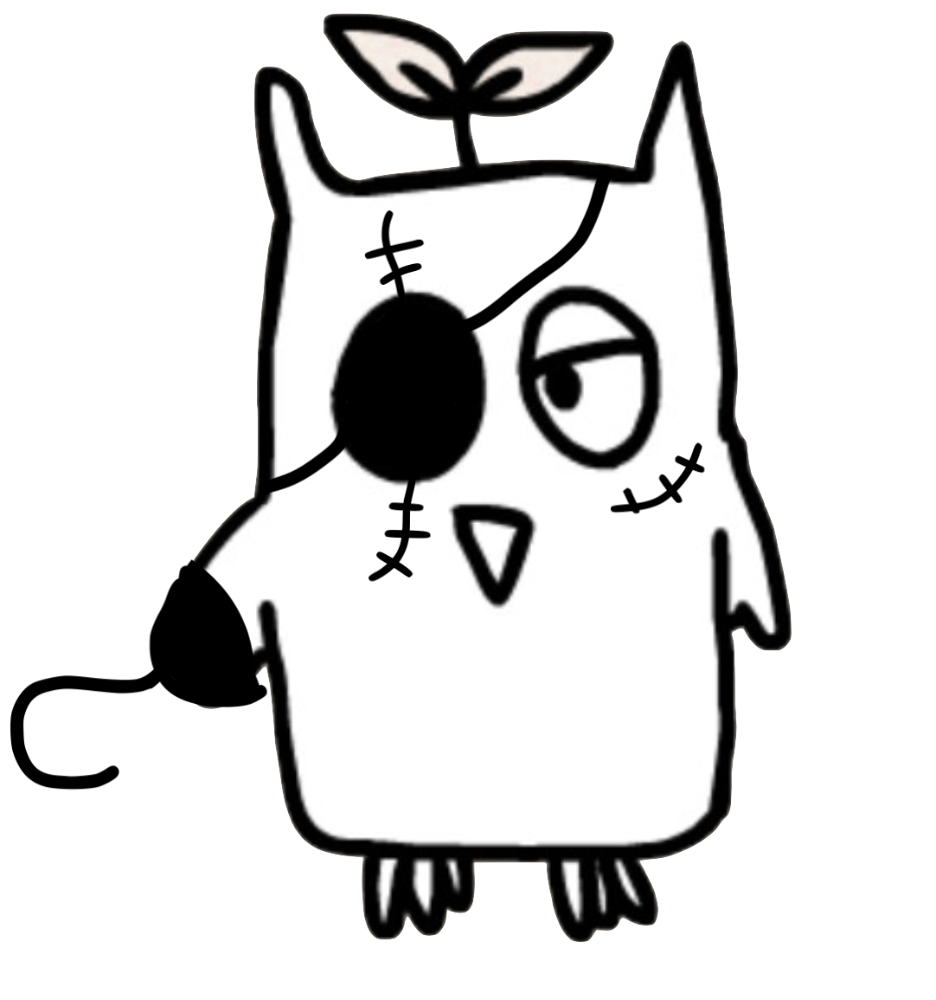
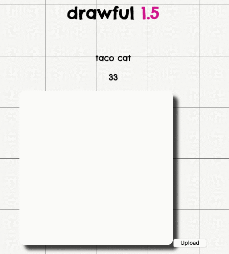
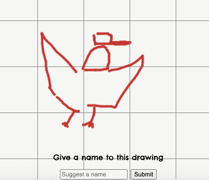
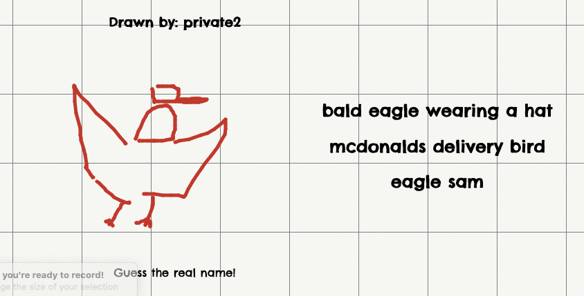

# Welcome to Drawful 1.5!
### A fun little clone of Drawful

Grab a few friends and play [here](https://elliott-king.github.io/drawful-1.5/frontend/)

Made with Rails api on the backend, vanilla JS on the front. Hosted on Github pages & Heroku.

### Gameplay
You will be given a prompt, which you will then have to draw. Each of your friends will see your drawing, and will attempt to guess the correct prompt. Yes, it will be completely unfair.

||
| --- |
| **Draw!** |

||
| --- |
| **Submit bogus prompts to confuse your opponents!** |

||
| --- |
| **Guess on your friend's drawings!** |

### Setup
You can download with `git clone` and set up with 
1. `bundle install`
2. `rails db:setup`
3. `rails db:schema:load`
4. `rails db:migrate` 
   
Single player will not work until you have played at least one multiplayer game.

### Technical Notes

For Heroku, we can only push the subtree with the app. See: 

https://coderwall.com/p/ssxp5q/heroku-deployment-without-the-app-being-at-the-repo-root-in-a-subfolder

Guide for setting up w/ Github Pages: 

https://medium.com/@angelospmusic/heroku-rails-api-javascript-front-end-9dfc06663624

#### Disclaimer
We do not own the rights to any Drawful content. This is merely a tribute.